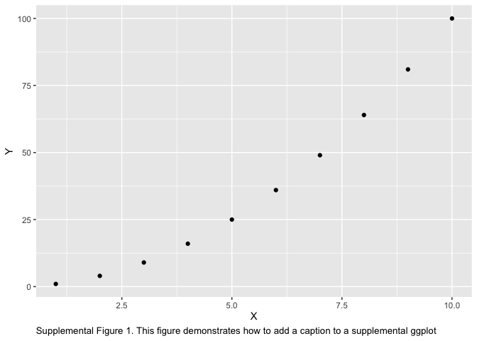

autoNumCaptions: An R package for auto-numbering html and markdown
figures
================
Keaton Stagaman
6/25/2019

<style>
caption {
      font-size: 12px;
      text-align: left;
    }
</style>

## Installation

    # install.packages("devtools")
    devtools::install_github("kstagaman/autoNumCaptions")

## Usage

When generating HTML or Markdown files using `knitr`, utilizing the
`caption` argument does not auto-number the figures or tables (as it
does when producing a PDF through LaTeX). This package allows one to add
auto-numbered captions directly to plots, ggplots, and tables.
Furthermore, because captions are not automattically wrapped to fit in
the plot space (`ggplot` doesn’t wrap caption text), these functions
wrap the text to a length (in columns) that can be specified by the
user.

``` r
my.theme <- theme_update(plot.caption = element_text(hjust = 0, vjust = 1, size = 10))
ggplot(df1, aes(x = X, y = Y)) +
  geom_point() +
  gg_figure_caption(caption = "This figure demonstrates how to add a caption to a ggplot")
```

<!-- -->

``` r
plot(
  df1$X, 
  df1$Y, 
  sub = figure.caption("This figure demonstrates how to add a caption to a base plot")
  )
```

<!-- -->

``` r
ggplot(df1, aes(x = X, y = Y)) +
  geom_point() +
  gg_figure_caption(
    caption = "This figure demonstrates how to add a caption to a supplemental ggplot",
    supplemental = TRUE
    )
```

<!-- -->

``` r
ggplot(df1, aes(x = X, y = Y)) +
  geom_point() +
  gg_figure_caption(
    caption = "This figure demonstrates how to add a caption to a supplemental ggplot and use \"S\" in front of the number instead of \"Supplemental\" in front of \"Figure\"",
    supplemental = TRUE,
    s.numbers = TRUE
    )
```

<!-- -->

``` r
kable(
  df2, 
  caption = table.caption("This table demonstrates how to add a caption to a kable table")
  ) %>% kable_styling(font_size = 12, bootstrap_options = "striped", full_width = T)
```

<table class="table table-striped" style="font-size: 12px; margin-left: auto; margin-right: auto;">

<caption style="font-size: initial !important;">

Table 1. This table demonstrates how to add a caption to a kable table

</caption>

<thead>

<tr>

<th style="text-align:left;">

A

</th>

<th style="text-align:right;">

B

</th>

<th style="text-align:left;">

C

</th>

<th style="text-align:right;">

D

</th>

<th style="text-align:left;">

E

</th>

<th style="text-align:right;">

F

</th>

<th style="text-align:right;">

G

</th>

<th style="text-align:right;">

H

</th>

</tr>

</thead>

<tbody>

<tr>

<td style="text-align:left;">

red

</td>

<td style="text-align:right;">

1.3710

</td>

<td style="text-align:left;">

TRUE

</td>

<td style="text-align:right;">

0

</td>

<td style="text-align:left;">

North

</td>

<td style="text-align:right;">

3.1416

</td>

<td style="text-align:right;">

1.0476

</td>

<td style="text-align:right;">

4

</td>

</tr>

<tr>

<td style="text-align:left;">

green

</td>

<td style="text-align:right;">

\-0.5647

</td>

<td style="text-align:left;">

FALSE

</td>

<td style="text-align:right;">

5

</td>

<td style="text-align:left;">

South

</td>

<td style="text-align:right;">

9.8696

</td>

<td style="text-align:right;">

0.8267

</td>

<td style="text-align:right;">

5

</td>

</tr>

<tr>

<td style="text-align:left;">

blue

</td>

<td style="text-align:right;">

0.3631

</td>

<td style="text-align:left;">

TRUE

</td>

<td style="text-align:right;">

10

</td>

<td style="text-align:left;">

West

</td>

<td style="text-align:right;">

36.4622

</td>

<td style="text-align:right;">

0.4278

</td>

<td style="text-align:right;">

7

</td>

</tr>

</tbody>

</table>

``` r
kable(
  df2, 
  caption = supp.tbl.caption(
    "This table demonstrates how to add a caption to a supplemental kable table"
    )
  ) %>% kable_styling(font_size = 12, bootstrap_options = "striped")
```

<table class="table table-striped" style="font-size: 12px; margin-left: auto; margin-right: auto;">

<caption style="font-size: initial !important;">

Supplemental Table 1. This table demonstrates how to add a caption to a
supplemental kable table

</caption>

<thead>

<tr>

<th style="text-align:left;">

A

</th>

<th style="text-align:right;">

B

</th>

<th style="text-align:left;">

C

</th>

<th style="text-align:right;">

D

</th>

<th style="text-align:left;">

E

</th>

<th style="text-align:right;">

F

</th>

<th style="text-align:right;">

G

</th>

<th style="text-align:right;">

H

</th>

</tr>

</thead>

<tbody>

<tr>

<td style="text-align:left;">

red

</td>

<td style="text-align:right;">

1.3710

</td>

<td style="text-align:left;">

TRUE

</td>

<td style="text-align:right;">

0

</td>

<td style="text-align:left;">

North

</td>

<td style="text-align:right;">

3.1416

</td>

<td style="text-align:right;">

1.0476

</td>

<td style="text-align:right;">

4

</td>

</tr>

<tr>

<td style="text-align:left;">

green

</td>

<td style="text-align:right;">

\-0.5647

</td>

<td style="text-align:left;">

FALSE

</td>

<td style="text-align:right;">

5

</td>

<td style="text-align:left;">

South

</td>

<td style="text-align:right;">

9.8696

</td>

<td style="text-align:right;">

0.8267

</td>

<td style="text-align:right;">

5

</td>

</tr>

<tr>

<td style="text-align:left;">

blue

</td>

<td style="text-align:right;">

0.3631

</td>

<td style="text-align:left;">

TRUE

</td>

<td style="text-align:right;">

10

</td>

<td style="text-align:left;">

West

</td>

<td style="text-align:right;">

36.4622

</td>

<td style="text-align:right;">

0.4278

</td>

<td style="text-align:right;">

7

</td>

</tr>

</tbody>

</table>

``` r
kable(
  df2, 
  caption = supp.tbl.caption(
    "This table demonstrates how to add a caption to a supplemental kable table and use \"S\" in front of the number instead of \"Supplemental\" in front of \"Table\"",
    s.numbers = TRUE
    )
  ) %>% kable_styling(font_size = 12, bootstrap_options = "striped")
```

<table class="table table-striped" style="font-size: 12px; margin-left: auto; margin-right: auto;">

<caption style="font-size: initial !important;">

Table S2. This table demonstrates how to add a caption to a supplemental
kable table and use “S” in front of the number instead of “Supplemental”
in front of “Table”

</caption>

<thead>

<tr>

<th style="text-align:left;">

A

</th>

<th style="text-align:right;">

B

</th>

<th style="text-align:left;">

C

</th>

<th style="text-align:right;">

D

</th>

<th style="text-align:left;">

E

</th>

<th style="text-align:right;">

F

</th>

<th style="text-align:right;">

G

</th>

<th style="text-align:right;">

H

</th>

</tr>

</thead>

<tbody>

<tr>

<td style="text-align:left;">

red

</td>

<td style="text-align:right;">

1.3710

</td>

<td style="text-align:left;">

TRUE

</td>

<td style="text-align:right;">

0

</td>

<td style="text-align:left;">

North

</td>

<td style="text-align:right;">

3.1416

</td>

<td style="text-align:right;">

1.0476

</td>

<td style="text-align:right;">

4

</td>

</tr>

<tr>

<td style="text-align:left;">

green

</td>

<td style="text-align:right;">

\-0.5647

</td>

<td style="text-align:left;">

FALSE

</td>

<td style="text-align:right;">

5

</td>

<td style="text-align:left;">

South

</td>

<td style="text-align:right;">

9.8696

</td>

<td style="text-align:right;">

0.8267

</td>

<td style="text-align:right;">

5

</td>

</tr>

<tr>

<td style="text-align:left;">

blue

</td>

<td style="text-align:right;">

0.3631

</td>

<td style="text-align:left;">

TRUE

</td>

<td style="text-align:right;">

10

</td>

<td style="text-align:left;">

West

</td>

<td style="text-align:right;">

36.4622

</td>

<td style="text-align:right;">

0.4278

</td>

<td style="text-align:right;">

7

</td>

</tr>

</tbody>

</table>
